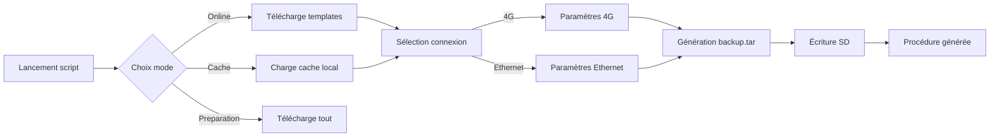

# 🛠️ Ewon Flexy SD Preparator

[](https://github.com/JohannPx/ewon-flexy-config/releases/latest)
[](LICENSE)
[](https://microsoft.com/powershell)

> Solution professionnelle pour la préparation automatisée de cartes SD Ewon Flexy avec génération dynamique de configurations personnalisées.

---

## ✨ Nouveautés v2.0

- 🎯 **Génération dynamique** : Les configurations sont créées à la volée selon vos paramètres
- 🧹 **Configuration optimisée** : Suppression automatique des paramètres inutilisés
- ✅ **Validation intelligente** : Vérification des IP, codes PIN et autres entrées
- 📝 **Documentation enrichie** : Procédure personnalisée avec vos paramètres

---

## 🎯 Objectif

Automatiser la préparation des cartes SD pour configurer les passerelles **Ewon Flexy** utilisées dans les installations industrielles, avec :
- Configuration réseau (LAN/WAN)
- Mise à jour firmware
- Intégration Talk2M (accès distant)
- Paramétrage de la remontée de données

---

## 🚀 Guide de démarrage rapide

### 1️⃣ Téléchargement

Rendez-vous dans **[Releases](../../releases/latest)** et téléchargez :
```
PrepareEwonSD_latest.ps1
```

### 2️⃣ Exécution

**Option A : Interface graphique**
- Clic-droit sur le fichier → **Exécuter avec PowerShell**

**Option B : Ligne de commande**
```powershell
powershell -ExecutionPolicy Bypass -File PrepareEwonSD_latest.ps1
```

### 3️⃣ Suivre les instructions

Le script vous guidera étape par étape pour :
1. Choisir le mode de fonctionnement
2. Sélectionner le type de connexion (4G/Ethernet)
3. Renseigner les paramètres spécifiques
4. Préparer la carte SD

---

## 🔧 Fonctionnalités principales

### 📊 Génération dynamique de configuration

Le script génère automatiquement un `backup.tar` personnalisé basé sur :

| Type | Paramètres demandés |
|------|-------------------|
| **Communs** | IP LAN, masque, identification Ewon, serveur NTP, timezone, mot de passe admin, compte data |
| **Ethernet** | Mode DHCP/Static, IP WAN, passerelle, DNS (si IP statique) |
| **4G** | Code PIN, APN, identifiants APN |

### 🧹 Optimisation automatique

- Les paramètres **Ethernet** sont automatiquement supprimés pour une config **4G**
- Les paramètres **4G** sont automatiquement supprimés pour une config **Ethernet**
- Résultat : des fichiers de configuration propres et optimisés

### 💾 Trois modes d'utilisation

| Mode | Description | Connexion Internet |
|------|-------------|-------------------|
| **ONLINE** | Télécharge les ressources à la demande | ✅ Requise |
| **CACHE** | Utilise les ressources déjà téléchargées | ❌ Non requise |
| **PREPARATION** | Télécharge tout pour usage ultérieur offline | ✅ Requise (une fois) |

---

## 📋 Prérequis système

| Composant | Minimum requis |
|-----------|---------------|
| **OS** | Windows 10/11 ou Windows Server 2016+ |
| **PowerShell** | 5.1 (inclus dans Windows) |
| **Carte SD** | FAT32, max 128 Go |
| **Espace disque** | 500 Mo pour le cache complet |

---

## 🔐 Sécurité et confidentialité

### ✅ Ce qui est sécurisé

- **Talk2M** : Les clés sont demandées à chaque exécution, jamais stockées
- **Mots de passe** : Saisie masquée, non affichés dans les logs
- **Cache local** : Stocké dans `%APPDATA%\EwonFlexConfig`

### ⚠️ Points d'attention

- Les templates contiennent des placeholders, pas de données sensibles
- Le manifest.json est public (aucune donnée confidentielle)
- Les firmwares sont téléchargés depuis les serveurs HMS officiels

---

## 🗂️ Structure du projet

```
ewon-flexy-config/
├── 📜 scripts/
│   └── Prepare_Ewon_SD.ps1     # Script principal
├── 📝 templates/                # Templates de configuration
│   ├── program.bas              # Script BASIC Ewon
│   ├── comcfg.txt              # Configuration communication
│   └── config.txt              # Configuration système
├── 📋 manifest.json            # Métadonnées et versions
└── 📚 .github/
    ├── workflows/
    │   └── build-release.yml   # CI/CD automatisé
    └── release-body.md         # Notes de version
```

---

## 🔄 Workflow de configuration



---

## 💬 Support et contribution

### 🐛 Signaler un problème

Utilisez l'onglet [Issues](../../issues) avec les informations suivantes :
- Version du script utilisée
- Mode sélectionné (Online/Cache/Preparation)
- Type de connexion (4G/Ethernet)
- Message d'erreur complet

### 🤝 Contribuer

1. Fork le projet
2. Créez votre branche (`git checkout -b feature/AmazingFeature`)
3. Committez (`git commit -m 'feat: Add AmazingFeature'`)
4. Push (`git push origin feature/AmazingFeature`)
5. Ouvrez une Pull Request

---

## 📜 Historique des versions

| Version | Date | Changements |
|---------|------|-------------|
| **v2.0.0** | 2025-01 | Génération dynamique, suppression lignes inutilisées |
| **v1.1.0** | 2025-01 | Mode preparation, cache local |
| **v1.0.0** | 2024-12 | Version initiale |

---

## 🏢 Informations légales

**© 2025 Clauger** - Tous droits réservés  
Usage réservé aux équipes Clauger et clients autorisés

**Contact technique** : support@clauger.com  
**Documentation Ewon** : [HMS Networks](https://www.hms-networks.com/)