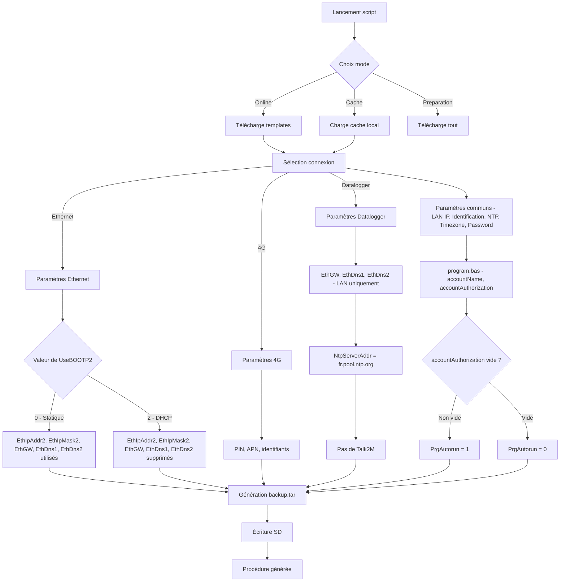

# 🛠️ Ewon Flexy SD Preparator

[](https://github.com/JohannPx/ewon-flexy-config/releases/latest)
[](LICENSE)
[](https://microsoft.com/powershell)

> Solution professionnelle pour la préparation automatisée de cartes SD Ewon Flexy avec interface graphique WPF et génération dynamique de configurations personnalisées.

---

## ✨ Nouveautés v5.1

- 🌍 **Multilingue** : Interface disponible en français, anglais, espagnol et italien (sélection par drapeaux)
- 🖥️ **Interface graphique WPF** : Wizard 8 étapes avec icône SD personnalisée (titre + barre des tâches)
- 🧩 **Architecture modulaire** : Code restructuré en 9 modules spécialisés (+ Localization.ps1)
- ✅ **Validation temps réel** : Icônes de validation à côté de chaque champ, champs obligatoires en IP statique WAN
- 🔄 **Champs conditionnels** : Affichage/masquage dynamique selon les choix (DHCP/statique, proxy, etc.)
- 📊 **Barre de progression** : Suivi visuel de la génération avec log en temps réel
- 🎯 **Génération dynamique** : Les configurations sont créées à la volée selon vos paramètres
- 🧹 **Configuration optimisée** : Suppression automatique des paramètres inutilisés
- 📦 **Cache intelligent** : Téléchargement automatique de tous les firmwares en arrière-plan (sans bloquer l'interface)
- 📄 **Archive tar robuste** : Génération fiable du backup.tar avec fallback POSIX intégré

---

## 🎯 Objectif

Automatiser la préparation des cartes SD pour configurer les passerelles **Ewon Flexy** utilisées dans les installations industrielles, avec :
- Configuration réseau (LAN/WAN)
- Mise à jour firmware
- Intégration Talk2M (accès distant)
- Paramétrage de la remontée de données

---

## 🚀 Guide de démarrage rapide

### 1️⃣ Téléchargement

Rendez-vous dans **[Releases](../../releases/latest)** et téléchargez :
```
PrepareEwonSD_latest.ps1
```

> **Note** : Le fichier téléchargé est un script unique auto-contenu. Les modules sont intégrés dans le fichier lors du build CI/CD.

### 2️⃣ Exécution

**Option A : Interface graphique**
- Clic-droit sur le fichier → **Exécuter avec PowerShell**

**Option B : Ligne de commande**
```powershell
powershell -ExecutionPolicy Bypass -File PrepareEwonSD_latest.ps1
```

### 3️⃣ Suivre le wizard

L'assistant graphique vous guide en 8 étapes :
1. **Mode & Firmware** : Online/Cache/Préparation + sélection firmware
2. **Type de connexion** : Modem 4G / Ethernet / Datalogger
3. **Paramètres réseau** : Configuration spécifique au type de connexion
4. **Paramètres communs** : IP LAN, NTP, timezone, mots de passe...
5. **Talk2M** : Clé d'enregistrement et description (sauf Datalogger)
6. **Lecteur SD** : Sélection du lecteur amovible
7. **Résumé** : Vérification avant génération
8. **Génération** : Progression et log en temps réel

---

## 🔧 Fonctionnalités principales

### 🌍 Multilingue (FR/EN/ES/IT)

- Sélection de la langue via drapeaux en haut de la première page
- Changement instantané de tous les textes, labels, messages et procédures
- Fallback automatique vers le français si une traduction manque

### 🖥️ Interface WPF

- Fenêtre wizard avec navigation Précédent/Suivant
- Icône SD personnalisée dans la barre de titre et la barre des tâches Windows
- Barre de progression par étape
- Champs générés dynamiquement depuis les définitions de paramètres
- Validation en temps réel avec indicateurs visuels (✔/✘)
- Champs IP WAN obligatoires en mode statique Ethernet
- Visibilité conditionnelle des champs (ex: DHCP masque les champs IP statiques)

### 📦 Cache intelligent

- Détection automatique de la connectivité au lancement
- Téléchargement en arrière-plan de tous les firmwares disponibles (sans bloquer l'UI)
- Affichage de la progression du cache dans la bannière de statut
- Les firmwares déjà en cache ne sont pas retéléchargés

### 📊 Génération dynamique de configuration

Le script génère automatiquement un `backup.tar` personnalisé basé sur :

| Type | Paramètres demandés |
|------|-------------------|
| **Communs** | IP LAN, masque, identification Ewon, serveur NTP, timezone, mot de passe admin, compte MyPortal3E |
| **Ethernet** | Mode DHCP/Static, IP WAN, passerelle, DNS (si IP statique), Proxy HTTP (optionnel) |
| **4G** | Code PIN, APN, identifiants APN |
| **Datalogger** | Passerelle LAN, DNS (communication via LAN uniquement, pas de Talk2M) |

### 🧹 Optimisation automatique

- Les paramètres **Ethernet** sont automatiquement supprimés pour une config **4G**
- Les paramètres **4G** sont automatiquement supprimés pour une config **Ethernet**
- Les paramètres **4G** et **Ethernet WAN** sont automatiquement supprimés pour une config **Datalogger**
- Résultat : des fichiers de configuration propres et optimisés

### 💾 Trois modes d'utilisation

| Mode | Description | Connexion Internet |
|------|-------------|-------------------|
| **ONLINE** | Télécharge les ressources à la demande | ✅ Requise |
| **CACHE** | Utilise les ressources déjà téléchargées | ❌ Non requise |
| **PREPARATION** | Télécharge tout pour usage ultérieur offline | ✅ Requise (une fois) |

---

## 📋 Prérequis système

| Composant | Minimum requis |
|-----------|---------------|
| **OS** | Windows 10/11 ou Windows Server 2016+ |
| **PowerShell** | 5.1 (inclus dans Windows) |
| **Carte SD** | FAT32, max 128 Go |
| **Espace disque** | 500 Mo pour le cache complet |

> **Aucune dépendance externe** : WPF est inclus nativement dans .NET Framework sur Windows.

---

## 🔐 Sécurité et confidentialité

### ✅ Ce qui est sécurisé

- **Talk2M** : Les clés sont demandées à chaque exécution, jamais stockées
- **Mots de passe** : Saisie masquée (PasswordBox WPF), non affichés dans les logs
- **Cache local** : Stocké dans `%APPDATA%\EwonFlexConfig`

### ⚠️ Points d'attention

- Les templates contiennent des placeholders, pas de données sensibles
- Le manifest.json est public (aucune donnée confidentielle)
- Les firmwares sont téléchargés depuis les serveurs HMS officiels

---

## 🗂️ Structure du projet

```
ewon-flexy-config/
├── 📜 scripts/
│   ├── Prepare_Ewon_SD.ps1         # Point d'entrée (~70 lignes)
│   └── modules/
│       ├── AppState.ps1             # État central (hashtable partagée)
│       ├── Localization.ps1         # i18n FR/EN/ES/IT (~160 clés × 4 langues)
│       ├── Validation.ps1           # Validateurs (IPv4, PIN, entier...)
│       ├── Config.ps1               # Définitions paramètres, conditions
│       ├── Network.ps1              # Téléchargements, cache, TLS
│       ├── Firmware.ps1             # Versions firmware, compatibilité, cache async
│       ├── Generator.ps1            # Templates, tar, T2M, procédure
│       ├── UIHelpers.ps1            # Création dynamique de champs WPF
│       └── UI.ps1                   # XAML wizard, événements, drapeaux
├── 📝 templates/                    # Templates de configuration
│   ├── program.bas                  # Script BASIC Ewon
│   ├── comcfg.txt                   # Configuration communication
│   └── config.txt                   # Configuration système
├── 📋 manifest.json                 # Métadonnées et versions
└── 📚 .github/
    ├── workflows/
    │   └── build-release.yml        # CI/CD (concaténation + release)
    └── release-body.md              # Notes de version
```

### 🔨 Build CI/CD

Lors d'un push sur `main`, le workflow GitHub Actions :
1. Concatène les 9 modules dans l'ordre de dépendance
2. Ajoute le launcher en fin de fichier
3. Produit un fichier unique `PrepareEwonSD_latest.ps1`
4. Publie une release GitHub avec ce fichier en téléchargement

En développement local, le launcher détecte le dossier `modules/` et charge les fichiers individuellement via dot-sourcing.

---

## 🔄 Workflow de configuration



---

## 💬 Support et contribution

### 🐛 Signaler un problème

Utilisez l'onglet [Issues](../../issues) avec les informations suivantes :
- Version du script utilisée
- Mode sélectionné (Online/Cache/Preparation)
- Type de connexion (4G/Ethernet/Datalogger)
- Message d'erreur complet (capture d'écran de la boîte d'erreur)

### 🤝 Contribuer

1. Fork le projet
2. Créez votre branche (`git checkout -b feature/AmazingFeature`)
3. Committez (`git commit -m 'feat: Add AmazingFeature'`)
4. Push (`git push origin feature/AmazingFeature`)
5. Ouvrez une Pull Request

---

## 📜 Historique des versions

| Version | Date | Changements |
|---------|------|-------------|
| **v5.1.0** | 2026-02 | Multilingue FR/EN/ES/IT, cache async firmware, icône app, validation obligatoire IP WAN, tar robuste |
| **v5.0.0** | 2026-02 | Interface WPF wizard, architecture modulaire 8 modules, validation temps réel |
| **v2.0.0** | 2025-01 | Génération dynamique, suppression lignes inutilisées |
| **v1.1.0** | 2025-01 | Mode preparation, cache local |
| **v1.0.0** | 2024-12 | Version initiale |

---

## 🏢 Informations légales

**© 2026 Clauger** - Tous droits réservés
Usage réservé aux équipes Clauger et clients autorisés

**Documentation Ewon** : [HMS Networks](https://www.hms-networks.com/)
